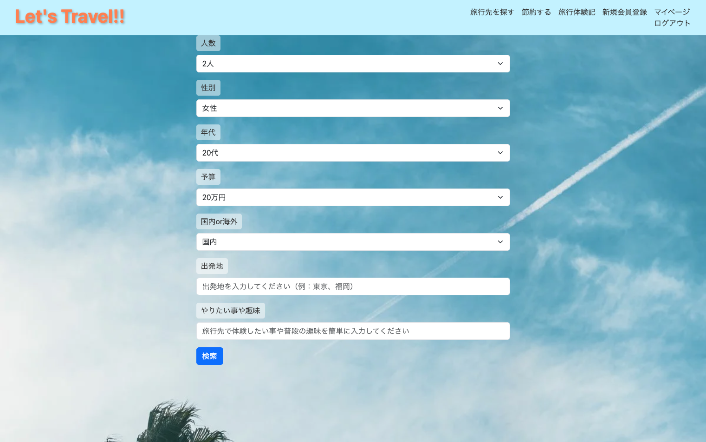
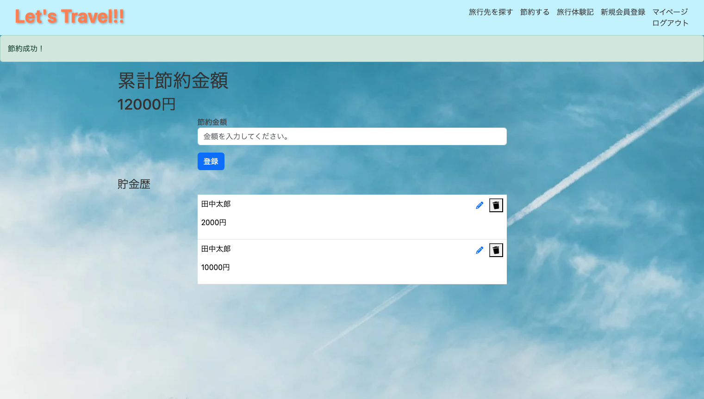
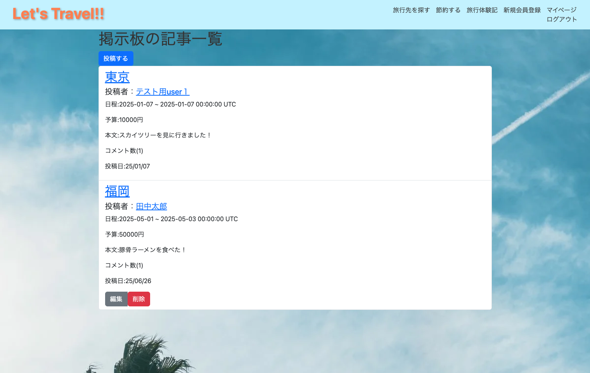
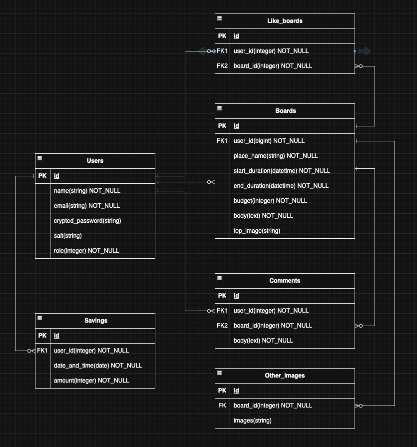

# 🛫Let's Travel - 旅行先提案アプリ
「旅行に行きたいけど迷っている人」へ、生成AIを活用して***あなたに合った旅行先***を提案し、さらに「節約の見える化」で旅行への金銭的不安も軽減する、旅行をもっと身近に感じられるサービスです。

 

# ✨主な機能
- 旅行先提案機能（ChatGPT活用）
  - 年齢・予算・趣味・フリーワードを入力することで、ユーザーごとにパーソナライズされた３件の旅行先（都市名・特徴）を提案
  - DeepL APIを導入し、トークン量削減
- 節約額可視化機能
  - 節約した金額をボタンで簡単記録
  - 節約額を累積表示し、旅行費用への心理的ハードルを軽減
- 旅行体験記
  - 旅行体験を投稿・閲覧できる掲示板機能（コメント機能付き）

 

| トップ画面 | 旅行先検索 |
| --- | --- |
|  |  |
| 旅行先提案 | 節約機能 |
|  |  |
| 旅行体験記 | 旅行体験記コメント機能 |
| |  |
| ユーザー登録 | マイページ |
|  |  |

 

# 🔧使用技術

| 分類      | 使用技術                                             |
| ------- | ------------------------------------------------ |
| バックエンド  | Ruby / Ruby on Rails 7 | 
| フロントエンド | JavaScript / Turbo / Bootstrap |
| 外部API | OpenAI(GPT-4o mini) / DeepL |
| CSS           | Bootstrap |
| DB            | PostgresSQL |
| テスト        | RSpec |
| インフラ      | Docker / Heroku |
| 認証          | Sorcery / Google OAuth |
| CI/CD        | GitHub Action |

 

# 🎯開発背景・このサービスへの思い
私自身、もともと旅行好きである一方、以下のような理由から海外旅行への一歩を踏み出せずにいました。
  - 旅行系サイトでおすすめの旅行先TOP３などがあるが、自分も楽しめるのだろうか？
  - 海外旅行は高額のイメージがあり、今の予算でどこまで行けるか分からない

実際に海外へ行き、異文化に触れたことで得た刺激と経験はかけがえのないものでした。\
この体験をきっかけに
『旅行に興味はあるものの迷っている人へ、半歩踏み出す後押しをしたい』\
という思いでこのサービスを企画・開発しました。\
また、節約額の可視化により「旅行は贅沢」という心理的ハードルを下げ、金銭面の不安を少しでも軽減できるように設計しています。

 

# 🚀差別化ポイント
既存の旅行提案サイトや家計簿アプリと異なり、本サービスでは、
- 生成AI（ChatGPT）を活用し、ユーザー個別の状況や趣味嗜好にマッチした具体的な旅行先を提案
- 家計簿ではなく"節約金額"を見える化することで、旅行への出費をポジティブに捉える設計

 

# ✏️ER図
